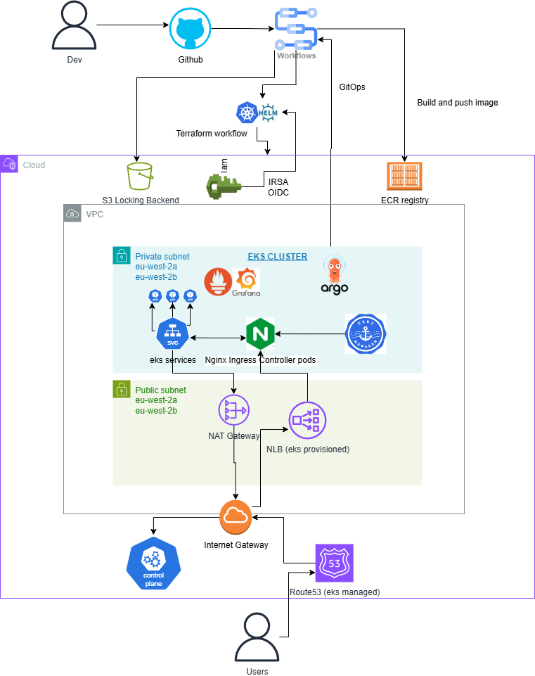

# EKS GitOps Showcase

This project is a **hands-on demonstration of modern Kubernetes operations on AWS**, showcasing how to build, deploy, and observe a cloud-native application using **EKS, Argo CD, Helm, Prometheus, and Grafana**.  

It proves out an **end-to-end GitOps workflow** — from infrastructure provisioning with Terraform, through automated deployments with Argo CD, to monitoring and observability with Grafana dashboards.

---

##  Architecture

The infrastructure is fully codified in **Terraform**, with the following key components:

- **Amazon EKS** — managed Kubernetes control plane  
- **Ingress-NGINX** — ingress controller fronted by an AWS NLB for routing HTTPS traffic  
- **cert-manager** — automated TLS certificates from Let’s Encrypt  
- **ExternalDNS** — automatic DNS management in Route53  
- **Cluster Autoscaler** — scales nodes dynamically based on workload  
- **Argo CD** — GitOps continuous delivery for Kubernetes manifests  
- **Prometheus + Grafana** — cluster metrics, dashboards, and alerts  
- **GitHub Actions** — CI/CD pipelines to build Docker images and push to ECR  

 *Infrastructure diagram:*

---

##  GitOps Flow

1. **Code pushed to GitHub** → GitHub Actions builds a Docker image with a multi-stage Dockerfile and pushes it to **Amazon ECR**.  
2. **Kubernetes manifests** (Deployment, Service, Ingress, etc.) are stored in the same repo.  
3. **Argo CD** continuously syncs these manifests into the EKS cluster, keeping live state aligned with Git.  
4. **Ingress + cert-manager + ExternalDNS** automatically provision DNS + TLS → HTTPS access for the app.  
5. **Prometheus** scrapes metrics from nodes, pods, and ingress-nginx.  
6. **Grafana** visualizes everything with custom dashboards (CPU/mem usage, pod health, ingress traffic, node status).  

---

##  Proof of Work

- **EKS Cluster** created and visible in AWS Console  
- **Argo CD** running inside EKS, managing the app via GitOps  
- **Deployed application** accessible over HTTPS (`https://app.zakariagatus.click`)  
- **Grafana dashboards** showing live metrics for pods, nodes, and ingress traffic  

 *Screenshots:*

---

##  Tools & Technologies

- **Infrastructure as Code**: Terraform  
- **Container Orchestration**: Kubernetes (Amazon EKS)  
- **Package Management**: Helm  
- **GitOps**: Argo CD  
- **Observability**: Prometheus, Grafana  
- **Networking**: Ingress-NGINX, AWS NLB, Route53, cert-manager (Let’s Encrypt)  
- **CI/CD**: GitHub Actions (OIDC → AWS, Checkov for security scanning)  
- **Security & Governance**: IRSA (IAM Roles for Service Accounts), Checkov, Terraform OIDC auth  

---

##  Highlights

- End-to-end **GitOps pipeline** from code commit → running app  
- **Zero long-lived secrets** (GitHub OIDC for AWS access)  
- **HTTPS and DNS automation** with cert-manager + ExternalDNS  
- **Cluster autoscaling** tested under load  
- **Security scanning** integrated with GitHub Actions (Checkov, Trivy)  
- **Full observability**: live Grafana dashboards showing cluster and ingress traffic health  

---

##  Why This Project Matters

This project brings together the **core tools every modern Kubernetes platform engineer should know** — EKS, Argo CD, Helm, Prometheus/Grafana — and demonstrates how they interconnect in a production-like environment.  

It proves my ability to:  
- Design and provision AWS infrastructure with Terraform  
- Operate Kubernetes clusters using best practices (IRSA, autoscaling, TLS)  
- Build secure CI/CD pipelines with GitHub Actions and OIDC  
- Deliver end-to-end visibility with Prometheus and Grafana  

---

 This project represents my **cloud-native DevOps skillset**:  
**Infrastructure as Code • GitOps • Observability • Secure CI/CD • Kubernetes on AWS**